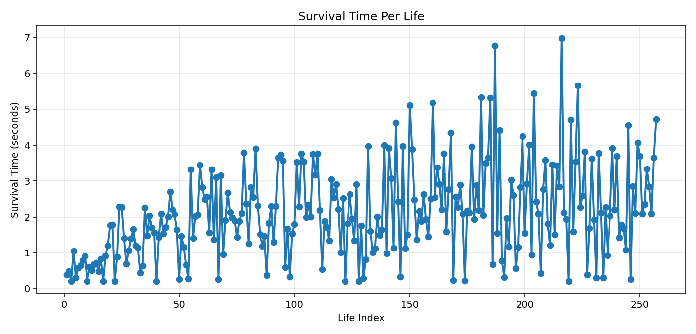

# RL_two_dots

파란 점(에이전트)이 빨간 점(비학습 추적 포인터)을 피하는 2D 게임입니다.
에이전트는 게임을 실행하는 동안 DQN으로 실시간 학습합니다.
사전학습은 필요 없습니다.

## 현재 동작 요약

- `life`는 1로 설정되어 있습니다.
- 빨간 점에 닿으면 `life -1`.
- `life`가 0이 되면 즉시 respawn합니다.
- 창을 닫을 때까지 무한 진행됩니다.

## 설치

```bash
cd /home/hassong327/sim/RL_two_dots
python3 -m venv .venv
source .venv/bin/activate
pip install -r requirements.txt
```

## 실행 (권장)

```bash
python3 play.py --mode online
```

- `online` 모드에서는 사람이 조작하지 않습니다.
- 에이전트가 스스로 이동하고, 매 스텝 학습합니다.

학습 강도를 높이려면:

```bash
python3 play.py --mode online --train-updates-per-step 12
```

## 생존시간 Plot 저장

게임 창을 닫으면, 각 life에서 살아있던 시간(초)을 플롯으로 저장합니다.
파일명은 자동으로 증가합니다.

- `plot1.png`
- `plot2.png`
- `plot3.png`

예시:



## 선택 모드

```bash
python3 play.py --mode human
```

- `human`은 테스트용 수동 조작 모드입니다.
- 기본 사용은 `online` 모드입니다.
